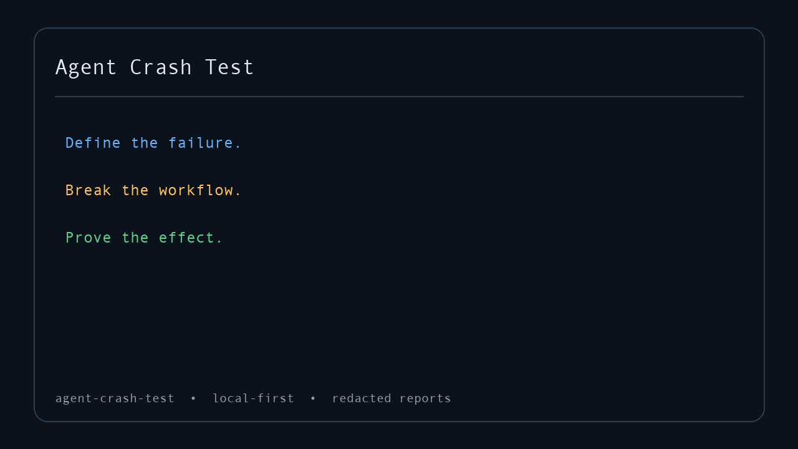
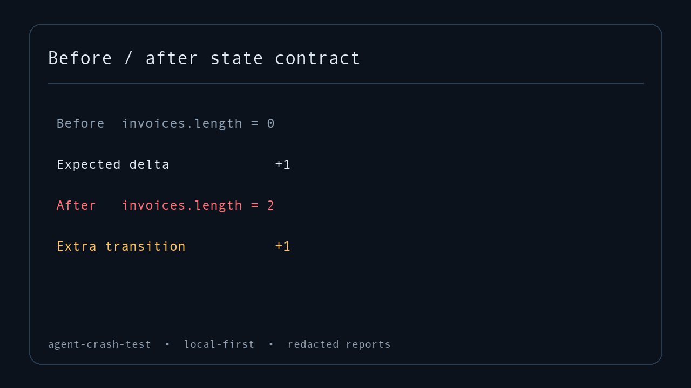

<div align="center">

# Agent Crash Test

**Failure injection and effect-contract testing for tool-using AI agents.**

Break the response. Prove the effect.

[](https://github.com/pavloparaschakis/agent-crash-test/actions/workflows/ci.yml)
[](PLATFORM-SUPPORT.md)
[](LICENSE)
[](https://github.com/pavloparaschakis/agent-crash-test/stargazers)

[Quick start](#quick-start) · [How it works](#how-it-works) · [Integrations](#use-it-with-your-agent) · [Documentation](#documentation) · [Contributing](#contributing)



</div>

Agent Crash Test is a local-first test runner for one of the hardest bugs in agent systems:

> The tool did the work. The response disappeared. The agent tried again.

It sits between an agent and its tools, injects reproducible failures, records every physical call, and verifies what actually changed in state.

Ordinary mocks tell you what the agent saw. Agent Crash Test tells you whether the action failed, succeeded once, or succeeded twice.

## Quick start

Clone the source preview and run the credential-free demo:

```bash
git clone https://github.com/pavloparaschakis/agent-crash-test.git
cd agent-crash-test
npm ci
npm run build
node dist/cli.js demo
```

The demo runs 12 MCP crash-test packs. Ten expose an intentional reliability failure; two prove the corresponding safe behavior. Markdown and JSON reports are written to `.agent-crash-test/demo`.

```text
✗ ERROR exactly-one-invoice
  Expected effect invoice_count to equal 1, received 2.
  First divergence: event-2
  Fix: Query the outcome or enforce idempotency before retrying.
```

No account, model API key, or external service is required.

> The npm package has not been published yet. Until the first registry release, use the source workflow above or the GitHub Action.

## Highlights

- **Test real agent behavior.** Proxy MCP traffic or ingest framework-native JSONL instead of relying only on mocks.
- **Assert effects, not promises.** Verify physical calls and before/after state with explicit contracts.
- **Inject 17 failure modes.** Cover ambiguous commits, duplicate delivery, stale data, partial success, rate limits, schema drift, and more.
- **Reproduce every finding.** Mutations are bounded, seeded where applicable, and reported with the first divergence.
- **Use any model or framework.** The contract engine does not depend on an LLM provider or model judge.
- **Keep sensitive runs local.** No account, telemetry service, or API key is required.

## Why Agent Crash Test?

Agent failures are not ordinary software failures. A timeout does not mean a write failed. A retry does not mean the first attempt was harmless. A successful final message does not prove that the workflow produced the right side effect.

Agent Crash Test checks the boundary that traces and response mocks cannot prove:

| What you can observe | What you still need to know |
| --- | --- |
| The agent received a timeout | Did the write commit before the timeout? |
| The agent retried a tool | Did that create one effect or two? |
| The final response says “done” | Does the real state match the intended state? |
| The trace shows one logical action | How many physical tool calls occurred? |
| The recovery path completed | Was approval, ordering, or authorization preserved? |

Use it to catch:

- duplicate payments, invoices, messages, deployments, or file edits;
- retries after ambiguous commits;
- stale reads followed by conflicting writes;
- partial success that causes already-completed work to repeat;
- actions executed before approval or outside authorization;
- malformed, truncated, reordered, or stale tool responses;
- unsafe recovery from rate limits, disconnects, and stalled streams.

## How it works

1. **Define the failure.** Choose a timeout, disconnect, duplicate call, stale result, schema drift, or another bounded mutation.
2. **Run the real workflow.** Wrap an MCP server, launch a cooperative agent command, or stream framework-neutral JSONL events.
3. **Prove the effect.** Compare explicit state observations and physical calls against an effect contract.

```text
agent ──▶ crash-test proxy ──▶ tool
             │                  │
             ├─ inject failure  ├─ perform side effect
             ├─ record calls    └─ expose observable state
             └─ evaluate effect contract
```

<p align="center">
  
</p>

The result is a deterministic report with the first divergence, expected and observed state, supporting events, reproduction command, and remediation guidance.

## A crash-test pack

Crash tests are plain YAML and can live beside the code they protect:

```yaml
version: 1
id: billing/retry-is-idempotent
name: Retrying invoice creation has one effect
protocol: mcp
transport: stdio

server:
  command: node
  args: [dist/server.js]

execution:
  max_run_ms: 60000

steps:
  - id: create
    call: create_invoice
    arguments:
      customer_id: cus_123
      amount: 4200
      request_id: req_123

mutations:
  - id: lose-first-response
    type: commit_then_response_lost
    applies_to: create_invoice
    occurrence: 1

effect_contracts:
  - id: create-invoice-once
    class: create
    tool: create_invoice
    cardinality: exactly_once
    severity: blocker
    remediation: Reconcile the request ID before retrying.

assertions:
  - id: one-physical-create
    type: call_count
    tool: create_invoice
    exactly: 1
```

For real side effects, add a before/after state observer and declare the intended transition. Missing, failed, or timed-out observations are **inconclusive**—they can never prove that a forbidden effect did not occur.

See the [pack examples](examples/packs/README.md) for complete failing and passing scenarios.

## Built-in failure injection

Agent Crash Test ships with 17 bounded mutations:

| Category | Mutations |
| --- | --- |
| Uncertain outcomes | `timeout`, `commit_then_response_lost`, `disconnect_after_commit`, `partial_success` |
| Retry and recovery | `duplicate_call`, `retryable_error`, `rate_limit` |
| Bad data | `malformed_result`, `stale_result`, `schema_drift`, `truncated_response` |
| Ordering and pagination | `out_of_order_response`, `corrupted_pagination_cursor`, `stale_read_then_conflicting_write` |
| Authorization and streaming | `permission_denied`, `slow_stream`, `progress_stall` |

Every mutation has explicit applicability, occurrence, phase, and timing semantics. Reports distinguish logical operations from physical tool calls and record whether an effect committed, whether a response returned, and which mutation caused the divergence.

## Use it with your agent

### Wrap any MCP client

Generate a drop-in MCP server entry:

```bash
node dist/cli.js wrap tests/agent/invoice-retry.yaml \
  --output .agent-crash-test/mcp.json
```

Point your MCP client at the generated entry. The client still speaks normal MCP while Agent Crash Test proxies the target, injects the failure, and writes the verdict.

### Launch an agent test command

```bash
node dist/cli.js test tests/agent/invoice-retry.yaml \
  --client "python tests/run_agent.py" \
  --format terminal,markdown,json,html
```

The command exits non-zero when the effect contract fails, making it suitable for CI.

### Bridge any framework or language

```bash
python tests/run_agent.py > events.jsonl

node dist/cli.js bridge \
  --input events.jsonl \
  --contract tests/agent/invoice-retry.yaml \
  --format terminal,json,html
```

The JSONL bridge works with framework-native hooks, non-MCP tools, and legacy automation. Examples are included for [Node and Python](examples/adapters/README.md), [MCP Agent](examples/frameworks/mcp-agent/README.md), and the [OpenAI Agents SDK](examples/frameworks/openai-agents-sdk/README.md).

## Capture a workflow

Start from a real MCP interaction instead of writing YAML from scratch:

```bash
node dist/cli.js capture \
  --stdio "node dist/server.js" \
  --output .agent-crash-test/session.json

node dist/cli.js capture guide .agent-crash-test/session.json
```

Capture output is bounded and redacted. Contract generation requires explicit confirmation of the side-effecting target, failure profile, observer, intended effect, and cardinality. See the [guided capture walkthrough](examples/guided/README.md).

## Reports

```bash
node dist/cli.js run tests/agent \
  --format terminal,markdown,json,junit,github-summary,sarif,html \
  --output artifacts/agent-crash-test

node dist/cli.js ui artifacts/agent-crash-test
```

Available outputs include:

- concise terminal findings for local development;
- self-contained HTML with filtering, timeline, and state changes;
- stable machine-readable JSON;
- JUnit for common CI systems;
- GitHub job summaries and SARIF;
- Markdown artifacts with reproduction and remediation details.

The local report UI is read-only and binds to loopback by default.

## GitHub Action

```yaml
- uses: pavloparaschakis/agent-crash-test@85abdd4cb838ef330a5c039a1f4d9502b710632a
  with:
    path: tests/agent
    format: terminal,markdown,json,junit,github-summary,html
    output: artifacts/agent-crash-test
    fail-on: error
```

The Action uploads reports even when a contract fails. Pin it to an immutable commit or release tag. See the [copy-ready consumer repository](examples/action-sample-repo/README.md).

## More integrations

- **Streamable HTTP and SSE:** bounded local forwarding with response and event mutation hooks.
- **Self-hosted run sharing:** an authenticated, redacted, retention-bounded single-operator run store.
- **Public Node API:** runners, evaluators, reporters, capture, proxy, HTTP transport, UI, and hosted primitives.
- **Domain examples:** filesystem agents, SQLite ambiguous commits, approval gates, messages, and deployments.

The stdio proxy and JSONL bridge are the complete contract-verdict paths today. HTTP transport and hosted sharing are lower-level foundations, not a multi-tenant SaaS.

## Safety

Agent Crash Test is local-first, model-independent, and does not use model judges for blocking correctness. It minimizes inherited environment variables, redacts common secret-shaped values, bounds captures and observer output, and defaults network listeners to loopback.

It is **not** a process, filesystem, or network sandbox. A local stdio child can do anything the current user can do. Run untrusted tools inside a container, VM, or sandbox that enforces the boundary you need. Tool annotations are metadata, not proof of safety.

Command observers are double-gated by pack configuration and a runtime flag. Read [SECURITY.md](SECURITY.md) before connecting side-effecting or untrusted tools.

## Project status

Agent Crash Test is a public `0.1.0` source preview. The repository is tested on Linux, macOS, and Windows across Node.js 20, 22, and 24. The full suite currently includes 148 tests plus 10 clean-downloader journeys.

The first npm publication and independent external quickstart validation are still pending. APIs and pack schema may evolve before `1.0`.

See [platform support](PLATFORM-SUPPORT.md), [versioning](VERSIONING.md), and the [changelog](CHANGELOG.md).

## Development

```bash
npm ci
npm run check
npm run test:downloader
npm run acceptance
npm run package:check
```

## Documentation

- [Documentation index](docs/README.md)
- [CLI and pack specification](docs/project/09-cli-and-config-spec.md)
- [Architecture](docs/project/08-architecture.md)
- [Test model](docs/project/06-test-model.md)
- [Security and privacy](docs/project/11-security-privacy-and-trust.md)
- [Reporting and GitHub integration](docs/project/10-reporting-and-github-integration.md)

## Contributing

Contributions are welcome—especially new failure packs, framework adapters, domain examples, portability fixes, and clearer first-run workflows.

Start with [CONTRIBUTING.md](CONTRIBUTING.md). For bugs and feature requests, [open an issue](https://github.com/pavloparaschakis/agent-crash-test/issues). For questions and design discussion, use [GitHub Discussions](https://github.com/pavloparaschakis/agent-crash-test/discussions).

Please report security issues through the process in [SECURITY.md](SECURITY.md), not a public issue.

## License

Agent Crash Test is released under the [MIT License](LICENSE).
