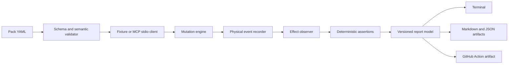

# Technical Architecture

## Recommended stack

- TypeScript for the CLI and core engine.
- Node.js LTS runtime.
- Zod or equivalent runtime validation for internal and external schemas.
- YAML parser with safe schema handling.
- Zod-backed runtime schema validation with a versioned report envelope.
- Node's built-in test runner for unit and integration tests.
- Docker/Podman optional for isolated demo environments.
- GitHub Actions for CI integration.
- Static HTML is a P1 reporting option, not part of the v0.1 runtime.

## Component map



```text
CLI
 ├── command router
 ├── config loader
 ├── transport adapters
 │    ├── MCP stdio
 │    ├── MCP Streamable HTTP (P1)
 │    └── fixture transport
 ├── recorder
 ├── normalized event model
 ├── mutation engine
 ├── assertion engine
 ├── state oracle and diff engine
 ├── redaction engine
 ├── report renderers
 └── exit-code policy
```

## Runtime flow

1. Parse CLI arguments.
2. Load configuration and test files.
3. Validate fixture schema.
4. Start a local stdio server or fixture transport.
5. Discover server manifest.
6. Build an execution plan.
7. Apply selected mutations through the local runner or fixture layer; a transparent proxy is P1.
8. Record normalized events.
9. Capture or reconstruct state snapshots.
10. Evaluate deterministic assertions and state deltas.
11. Render reports.
12. Apply exit-code policy.
13. Clean up child processes and temporary files.

## Normalized event model

Every transport adapter should emit events with:

```ts
type AgentEvent = {
  sequence: number;
  timestamp: string;
  direction: "client_to_server" | "server_to_client";
  method?: string;
  tool?: string;
  arguments?: unknown;
  result?: unknown;
  error?: { code?: string | number; message: string };
  latencyMs?: number;
  mutation?: { id: string; seed: number };
  redaction?: { paths: string[] };
};
```

The report and assertion layers must not depend on raw MCP wire details.

## State oracle interface

```ts
interface StateOracle {
  before(context: RunContext): Promise<StateSnapshot>;
  after(context: RunContext): Promise<StateSnapshot>;
  diff(before: StateSnapshot, after: StateSnapshot, options: DiffOptions): StateDelta[];
}
```

The first implementation should provide a fixture-backed oracle and explicitly declared MCP effect probes. Observed-response reconstruction and a command-snapshot oracle can follow without changing the assertion format.

## Isolation model

Default execution uses a minimal environment, a child-process timeout, bounded stderr capture, redaction, and explicit effect-probe policy. Normal stdio mode does not enforce host-network or filesystem isolation; use a container or VM when those boundaries matter.

Container isolation is an optional hardening layer, not a prerequisite for the first release.

## Adapter interface

```ts
interface ProtocolAdapter {
  discover(target: Target, options: DiscoverOptions): Promise<ServerManifest>;
  invoke(request: ToolRequest): Promise<ToolResponse>;
  close(): Promise<void>;
  capabilities(): AdapterCapabilities;
}
```

## Failure handling

All errors must be typed. The CLI should distinguish configuration errors, fixture errors, transport errors, server errors, assertion failures, mutation failures, and internal bugs. User-facing output should suggest the next action.

## Performance targets

- CLI startup under 500 ms after warm install.
- Discovery under 5 seconds for a local healthy server.
- Ten deterministic fixtures under 30 seconds on a standard laptop.
- Report generation under 2 seconds for 1,000 events.
- Memory under 256 MB for a 10,000-event fixture.
