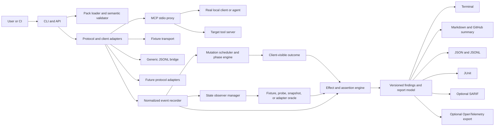

# Target Architecture and Contract Specification

**Purpose:** Define the technical target for the second- and third-pass expansion.
**Design objective:** Add real-client interception and protocol breadth without duplicating the mutation, assertion, redaction, and reporting engines.
**Compatibility objective:** Preserve the v0.1 fixture and MCP stdio paths while introducing versioned contracts.

---

## 1. Architecture principles

1. **Adapters translate; the core reasons.** Protocol adapters should emit normalized events and consume normalized outcomes. They must not implement their own assertion semantics.
2. **Logical and physical activity are separate.** One logical tool operation may result in multiple physical calls because of retries, duplicates, reconnects, or compensation.
3. **Mutation phase is explicit.** A timeout before execution is not the same as a response lost after commit.
4. **State evidence is first-class.** A report should be able to say that an effect was present, absent, changed, forbidden, or unobservable.
5. **The default is local and bounded.** No network, credentials, production state, or telemetry is implied by a pack.
6. **Every output is versioned.** Packs, normalized events, reports, mutations, and adapter capabilities must have explicit versions.
7. **Determinism is declared, not assumed.** The report records whether a run is deterministic, partially deterministic, or nondeterministic.
8. **Interoperability is optional and additive.** JSONL, OpenTelemetry, JUnit, and SARIF are adapters around the core contract, not competing sources of truth.

---

## 2. Target component architecture



### 2.1 Core components

| Component | Responsibility | Must not own |
|---|---|---|
| Pack loader | Parse, validate, resolve paths, enforce schema and policy | Protocol-specific transport behavior |
| Adapter manager | Start, connect, invoke, observe, and close a target | Assertion interpretation |
| Proxy | Forward real traffic and apply phase-specific faults | User-facing scoring or remediation logic |
| Mutation engine | Decide when and how a fault is applied | Hidden physical calls |
| Event recorder | Record complete logical and physical activity | Report formatting |
| State observer manager | Capture before/after evidence and errors | Trust decisions based only on annotations |
| Assertion engine | Evaluate effects, forbidden transitions, call rules, and recovery | Starting or killing processes |
| Report model | Normalize findings and reproduction data | Transport startup |
| Renderers | Present the report in each output format | Recomputing assertions |
| Release/Action layer | Package and execute the tool in CI | Core test semantics |

---

## 3. Execution modes

### 3.1 Fixture mode — current v0.1 baseline

Fixture mode remains the fastest and most deterministic path. It should be used for:

- unit and integration tests of the engine;
- documentation examples;
- the community corpus;
- offline demos;
- regression testing of mutation semantics.

### 3.2 Scripted MCP mode — current v0.1 baseline

Scripted MCP mode invokes declared steps against a local MCP stdio server. It is useful for server contract tests and controlled server behavior, but it does not fully exercise an arbitrary agent’s decision policy.

### 3.3 Transparent MCP proxy mode — expansion centerpiece

Proxy mode inserts Agent Crash Test between a real client and a target server. It must support:

- forwarding initialization and discovery;
- request/response correlation;
- response mutation;
- transport interruption;
- duplicate physical invocation;
- event capture;
- process cleanup;
- controlled state observation.

Proxy mode is the first mode that can test an existing agent without requiring a custom scripted runner.

### 3.4 Generic JSONL mode — protocol-neutral bridge

The generic bridge allows a client implemented in any language to emit normalized execution records. It is not a network protocol and should remain deliberately simple:

- one JSON object per line;
- explicit `run_id` and `operation_id`;
- bounded record size;
- no arbitrary code execution in records;
- clear end-of-run marker;
- error if required correlation fields are missing.

### 3.5 Future modes

Streamable HTTP, remote authenticated targets, and other protocols remain adapter candidates. They must not alter the core report or effect model.

---

## 4. Normalized event contract

### 4.1 Required event fields

```ts
type NormalizedEvent = {
  schemaVersion: number;
  runId: string;
  eventId: string;
  sequence: number;
  timestamp: string;
  direction: "client_to_target" | "target_to_client" | "observer" | "runner";
  kind:
    | "run_start"
    | "discovery"
    | "logical_call"
    | "physical_call"
    | "response"
    | "retry"
    | "duplicate"
    | "transport_error"
    | "effect_probe"
    | "state_snapshot"
    | "mutation"
    | "run_end";
  operationId?: string;
  parentEventId?: string;
  stepId?: string;
  tool?: string;
  arguments?: JsonValue;
  outcome?: NormalizedOutcome;
  physicalCall: boolean;
  attempt?: number;
  mutationIds?: string[];
  mutationPhase?: MutationPhase;
  durationMs?: number;
  redactionApplied: boolean;
};
```

### 4.2 Logical versus physical calls

The recorder must preserve both:

- **logical call:** what the agent or scripted plan intended;
- **physical call:** what reached the target tool server.

Example:

```text
logical operation op-1: create_issue
  physical call event-2: create_issue, attempt 1, committed, response lost
  physical call event-3: create_issue, attempt 2, committed, response returned
  observer event-4: issue_count changed 0 → 2
```

The report must not collapse these events into one “tool called” line.

### 4.3 Correlation requirements

- adapters must provide a stable operation ID when the client provides one;
- the runner generates one when none exists;
- retries preserve the logical operation ID and receive distinct physical event IDs;
- duplicate mutations create a child physical event linked to the triggering event;
- observer calls have their own event IDs and never disappear into assertion internals;
- event ordering is stable even when timestamps have the same millisecond value.

---

## 5. Outcome and mutation contract

### 5.1 Normalized outcome

```ts
type NormalizedOutcome = {
  status: "success" | "error" | "timeout" | "disconnected" | "malformed" | "unknown";
  output?: JsonValue;
  error?: {
    kind: string;
    message: string;
    retryable?: boolean;
    source?: string;
  };
  commitStatus: "not_attempted" | "not_committed" | "committed" | "unknown";
  responseStatus: "not_returned" | "returned" | "corrupted" | "lost";
};
```

The `commitStatus` and `responseStatus` fields are essential. They let the tool distinguish:

- a call that never reached the target;
- a call that failed before committing;
- a call that committed but returned an error;
- a call that committed but lost its response;
- a call whose commitment cannot be established.

### 5.2 Mutation phases

```ts
type MutationPhase =
  | "before_underlying_call"
  | "during_underlying_call"
  | "after_commit_before_response"
  | "after_response_before_client"
  | "client_visible_transport_failure"
  | "observer_only";
```

Every mutation definition must specify:

- its stable ID;
- version;
- phase;
- target selection;
- occurrence or scheduling rule;
- seed behavior;
- whether the underlying call is executed;
- whether the effect may have committed;
- client-visible outcome;
- expected remediation category;
- safety boundary.

### 5.3 Initial expanded mutations

| Mutation | Phase | Underlying call | Client sees | Primary risk |
|---|---|---:|---|---|
| `timeout` | during/after response | configurable | timeout | retry behavior |
| `retryable_error` | after underlying call | yes | retryable error | duplicate or missed recovery |
| `malformed_result` | after response | yes | malformed output | wrong downstream decision |
| `stale_result` | after response | prior result | stale output | stale write or wrong action |
| `duplicate_call` | after underlying call | yes, twice | original result | duplicate side effect |
| `permission_denied` | before call | no | denial | incorrect success handling |
| `commit_then_response_lost` | after commit | yes | timeout/disconnect | unknown outcome retry |
| `disconnect_after_commit` | after commit | yes | transport close | duplicate recovery |
| `partial_success` | after partial effects | yes | structured partial failure | inconsistent state |
| `stale_read_then_conflicting_write` | observer/workflow | yes | stale read | lost update |

### 5.4 Mutation fidelity rule

A mutation is not accepted merely because it produces an error string. It is accepted only when the engine can demonstrate that the injected condition matches its declared semantic phase and physical behavior.

---

## 6. Effect and state contract

### 6.1 Proposed conceptual schema

```ts
type EffectContract = {
  id: string;
  class: "read" | "create" | "update" | "delete" | "send" | "approve" | "deploy" | "publish";
  description: string;
  preconditions?: StateExpectation[];
  intended: StateExpectation[];
  forbidden?: StateExpectation[];
  cardinality?: "zero_or_one" | "at_most_once" | "exactly_once" | "at_least_once";
  ordering?: OrderingConstraint[];
  authorization?: AuthorizationExpectation;
  recovery?: RecoveryExpectation;
  severity: Severity;
  remediation: string;
};
```

### 6.2 State snapshot

```ts
type StateSnapshot = {
  observerId: string;
  capturedAt: string;
  value?: JsonValue;
  source: "fixture" | "tool" | "command" | "adapter";
  safety: "fixture" | "declared_read_only" | "explicit_unsafe_opt_in";
  complete: boolean;
  redactionApplied: boolean;
  error?: NormalizedError;
};
```

### 6.3 Observer policy

An observer must declare:

- what it reads;
- whether it can mutate state;
- how it is isolated;
- timeout;
- maximum output size;
- redaction mode;
- whether failure is blocking or inconclusive;
- whether the result can be used for a safety-critical assertion.

The runner must fail closed for a required observer. A missing observation must not be interpreted as “no effect.”

---

## 7. Adapter contract

```ts
interface ExecutionAdapter {
  readonly id: string;
  readonly version: string;
  capabilities(): AdapterCapabilities;
  connect(context: AdapterContext): Promise<void>;
  discover(context: AdapterContext): Promise<ToolManifest[]>;
  invoke(request: NormalizedToolRequest): Promise<NormalizedOutcome>;
  observe?(request: ObserverRequest): Promise<StateSnapshot>;
  events(): AsyncIterable<NormalizedEvent>;
  close(reason: CloseReason): Promise<CloseResult>;
}
```

### 7.1 Adapter capabilities

Capabilities must include:

- protocol name and version;
- transport;
- whether a real client is supported;
- whether physical call interception is supported;
- whether response mutation is supported;
- whether transport disconnect is supported;
- whether state observation is supported;
- determinism classification;
- sandbox requirements;
- known limitations.

### 7.2 MCP stdio proxy adapter

The proxy adapter must:

- start the target server with a minimal environment;
- establish a client-facing and target-facing transport;
- forward messages without changing semantics unless a mutation is selected;
- preserve ordering and framing;
- record raw values only in bounded, redacted form;
- expose physical target calls to the normalized recorder;
- handle target crash, hang, malformed protocol, and unexpected EOF.

### 7.3 Generic JSONL adapter

The JSONL bridge must accept records such as:

```json
{"type":"run_start","run_id":"run-1","adapter":"example-agent"}
{"type":"tool_call","run_id":"run-1","operation_id":"op-1","tool":"create_issue","arguments":{"title":"x"}}
{"type":"tool_result","run_id":"run-1","operation_id":"op-1","status":"unknown","commit_status":"unknown","response_status":"lost"}
{"type":"state_snapshot","run_id":"run-1","observer_id":"issues","value":{"count":1}}
{"type":"run_end","run_id":"run-1","status":"complete"}
```

The bridge must reject:

- missing run IDs;
- duplicate terminal records;
- unbounded line length;
- unsupported record types;
- invalid JSON;
- records that claim redaction without applying it where required.

---

## 8. Capture architecture

### 8.1 Capture stages

1. Preflight target and policy.
2. Start an isolated or explicitly bounded capture session.
3. Discover tools and record manifest.
4. Forward approved calls.
5. Record requests, responses, timing, and errors.
6. Apply redaction before persistence.
7. Detect nondeterministic fields and annotate them.
8. Write a capture envelope.
9. Generate a starter pack with incomplete-effect warnings.
10. Require user review before the pack is treated as a regression test.

### 8.2 Capture envelope

```ts
type CaptureEnvelope = {
  schemaVersion: number;
  captureId: string;
  createdAt: string;
  adapter: { id: string; version: string };
  target: { protocol: string; transport: string; command?: string };
  determinism: "deterministic" | "partial" | "nondeterministic";
  manifest: ToolManifest[];
  events: NormalizedEvent[];
  redaction: RedactionSummary;
  warnings: string[];
};
```

### 8.3 Capture safety

- capture is local-only by default;
- no hosted upload;
- environment values are not persisted;
- raw authorization headers and token-shaped values are redacted;
- target command and paths are shown with clear data-boundary warnings;
- capture cannot silently run against a production endpoint;
- a user must explicitly opt into unsafe target behavior;
- the generated pack records what it does not know.

---

## 9. Reporting architecture

### 9.1 Finding model additions

```ts
type FindingFingerprint = {
  algorithm: "sha256";
  value: string;
  inputs: string[];
};

type ExpandedFinding = Finding & {
  fingerprint: FindingFingerprint;
  operationId?: string;
  mutationPhase?: MutationPhase;
  commitStatus?: NormalizedOutcome["commitStatus"];
  responseStatus?: NormalizedOutcome["responseStatus"];
  observerStatus?: "present" | "absent" | "changed" | "forbidden" | "inconclusive";
  adapter: { id: string; version: string };
};
```

### 9.2 Fingerprint inputs

The stable fingerprint should be derived from normalized values, not timestamps or absolute paths. Suggested inputs:

- pack ID;
- assertion ID;
- mutation ID and version;
- normalized target tool;
- effect ID;
- first divergent event kind;
- normalized expected/observed category;
- schema major version.

### 9.3 Output responsibilities

- terminal: immediate diagnosis;
- Markdown: human review and artifact sharing;
- JSON: machine consumption and future tools;
- JUnit: existing test dashboards;
- GitHub summary: pull-request usability;
- SARIF: opt-in code-scanning integration with explicit caveats;
- OpenTelemetry: optional trace correlation, never the normative report.

---

## 10. Security and isolation architecture

### 10.1 Default boundary

Normal local stdio mode does not enforce host network or filesystem denial. Documentation must repeat this wherever untrusted targets are introduced.

### 10.2 Optional sandbox boundary

The optional container profile should support:

- `--network none` or equivalent;
- non-root execution;
- read-only root filesystem;
- explicit writable artifact directory;
- no inherited credentials;
- bounded process and resource limits;
- explicit working-directory mount;
- target command allowlist or user confirmation;
- cleanup after timeout or crash.

### 10.3 Pack trust levels

Every pack should be classifiable as:

- `fixture_only`;
- `local_process`;
- `local_process_with_observer`;
- `external_boundary_required`;
- `unsafe_opt_in`.

The CLI should display this trust level before execution and make unsafe transitions explicit.

### 10.4 Redaction requirements

Redaction must cover:

- tool arguments;
- tool results;
- errors;
- server stderr;
- tool descriptions and annotations;
- capture files;
- Markdown and JSON artifacts;
- JUnit failure messages;
- OpenTelemetry attributes when enabled;
- generated reproduction metadata where environment names may leak data.

The test corpus must include token, password, API key, cookie, authorization header, email, URL query secret, and multiline secret cases.

---

## 11. Performance and reliability targets

### P0 targets

- demo startup under five seconds after dependencies are installed;
- capture of a small local workflow under ten seconds excluding user interaction;
- ten fixture packs under thirty seconds on a standard laptop;
- proxy overhead under 50 ms per normal local request when no mutation is active;
- bounded memory for 10,000 normalized events;
- no unbounded stderr, stdout, or capture growth;
- clean target shutdown within documented grace period;
- deterministic fixture runs with zero unexplained flakes.

### P1 targets

- parallel fixture execution with isolated state;
- large trace streaming without retaining all raw values in memory;
- artifact size limits and truncation notices;
- configurable retry and observer budgets;
- graceful partial report on process crash.

---

## 12. Compatibility and versioning

### Required versioned artifacts

- pack schema;
- normalized event schema;
- mutation engine;
- mutation definitions;
- report schema;
- adapter contract;
- capture envelope;
- redaction rules.

### Compatibility rules

- major versions may remove or reinterpret fields;
- minor versions add optional fields and capabilities;
- patch versions fix behavior without changing semantic meaning;
- mutations are never silently redefined;
- a report must state the runner, schema, adapter, and mutation versions;
- a pack that depends on unavailable capabilities fails as unsupported, not as a misleading assertion failure.

---

## 13. Architecture acceptance checklist

- [ ] Fixture mode still passes all existing controls.
- [ ] Scripted MCP mode still produces equivalent v0.1 semantics.
- [ ] Proxy mode can exercise a real client.
- [ ] Logical and physical events are both visible.
- [ ] Mutation phase is present in events and findings.
- [ ] Commit status and response status are distinct.
- [ ] Required observer failure is never interpreted as no effect.
- [ ] JSONL adapter can be implemented without TypeScript.
- [ ] Reports remain consistent across renderers.
- [ ] Redaction applies before persistence and export.
- [ ] Clean shutdown is verified on pass, failure, timeout, crash, and interrupt.
- [ ] Version metadata appears in every reproducible report.
- [ ] P1 interfaces can be added without changing the assertion engine.
